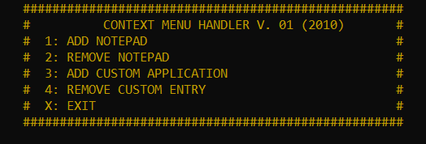

# CONTEXT MENU HANDLER

Tool to add / remove context menu entries

## Getting Started

Run MAIN.BAT

### Interface

```
Screenshot.jpg
```


## Files

* main.bat : Maain script file
* sample_add_notepad.reg : sample registry file for the test code
* screenshot.jpg : interface screenshot
